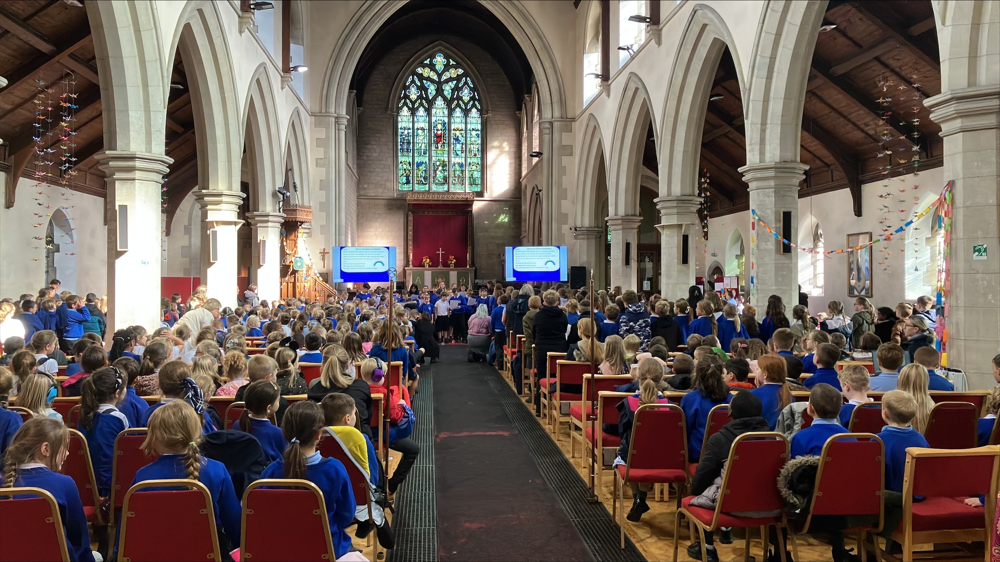
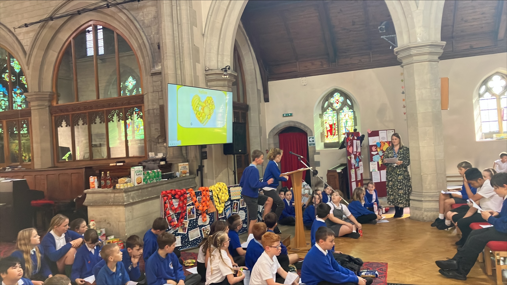

St. Peter's Church hosted our traditional Harvest Festival. The festival featured readings by some super Year pupils, songs by the choir and by all, and a parade of thanskgiving from all seasons and all hemispheres.

Many thanks to all those who supported the festival in different ways. Thank you for your donations of food that adorned the isle. They were passed to [Rydale Community Food Bank](https://www.ryedalecommunityfoodbank.co.uk) for distribution to those in need.

Huge thanks to Rev. Jenny Buckler, vicar of St. Peter's, who welcomed us to her church with open arms.

Thanks finally, to our own Mrs Rose, who planned, choreographed and rehearsed us all beforehand, and directed on the day.